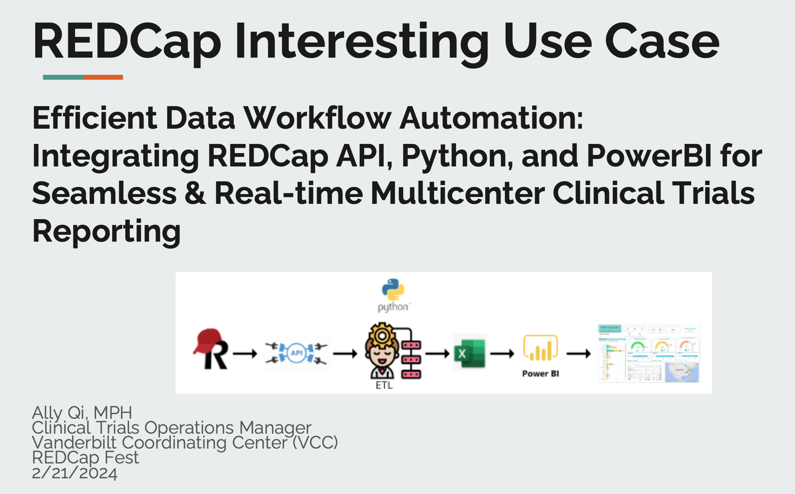
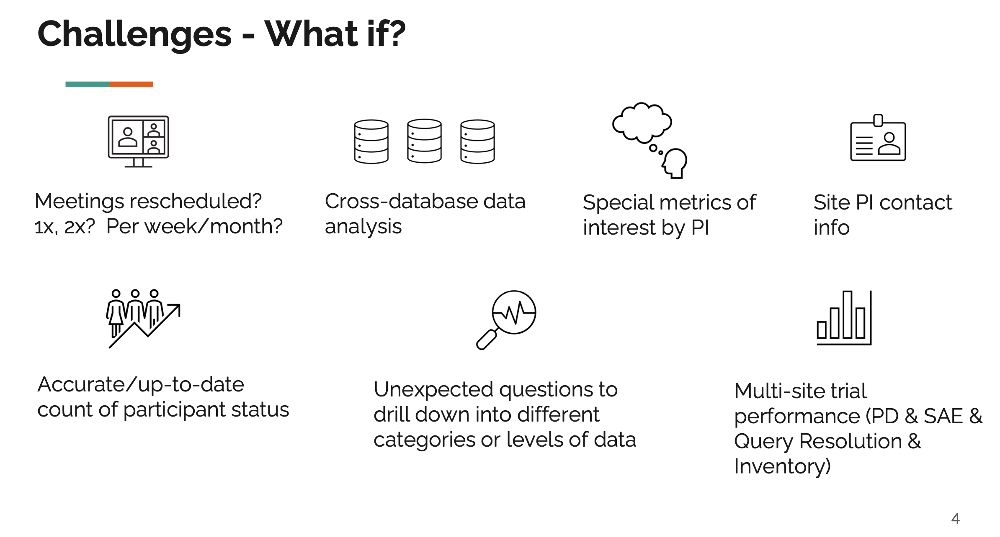
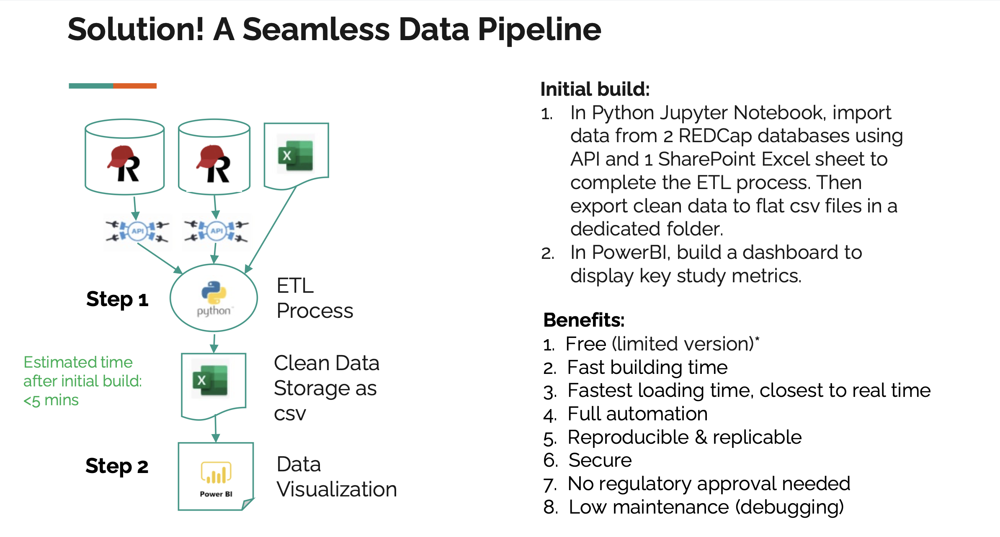
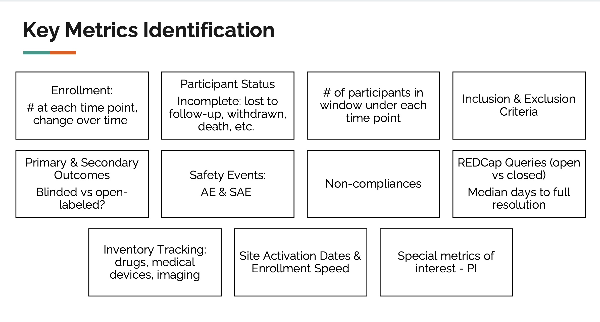
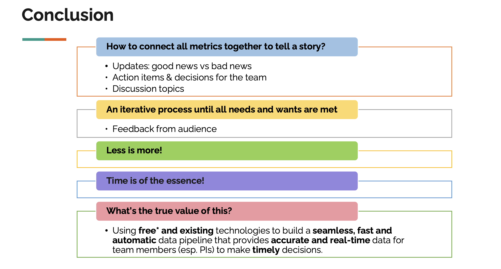

# clinical_trial_dashboard

# The PowerBI dashboard for mutli-site clinical trial management

## Presentation Title 
REDCap Interesting Use Case: Efficient Data Workflow Automation: Integrating REDCap API, Python, and PowerBI for Seamless & Real-time Multicenter Clinical Trials Reporting

## Featuring:
Framing Eighteen Coils in Cerebral Aneurysms Trial (FEAT)

#### Online Recording
[Click here](https://redcap.vumc.org/surveys/?__report=DTT7NHH8XYAFNTPL)

#### Presentation Slides
[View the PDF document](REDCapFest_AllyQi_2.17.2024.pdf)

## Disclaimer
This demo dashboard used simulated (fake) datasets. All site info is publicly available on Clinicaltrials.gov.

## Overview

## Common Challenges

## ETL Pipeline

## Demo

## Key Metrics

## Why not direct REDCap to PowerBI connection? 
I didn't present this slide at the conference due to time limit. 

## Conclusion

## Acknowledgment

## Data Source
REDCap EDC

## Tools & Technologies
REDCap API, Jupypter Notebook - Python, PowerBI, Excel

## References
[REDCap](https://projectredcap.org/)
[Vanderbilt Coordinating Center](https://vcc.vumc.org/)